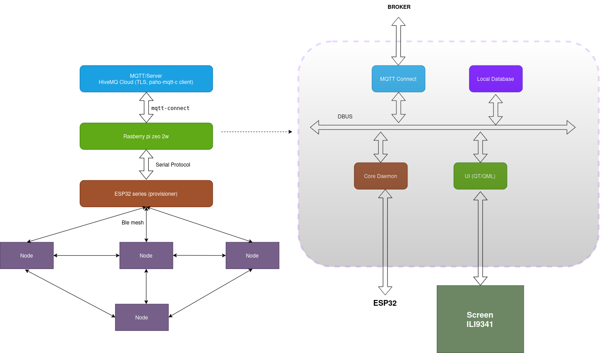
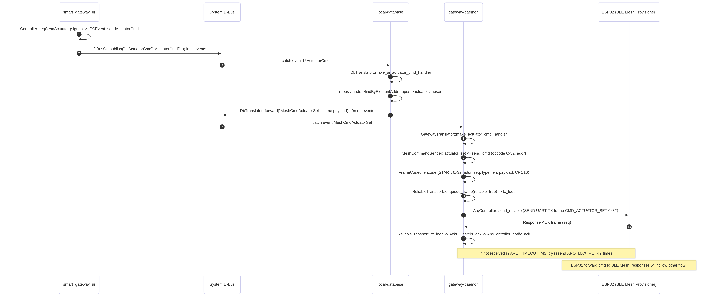
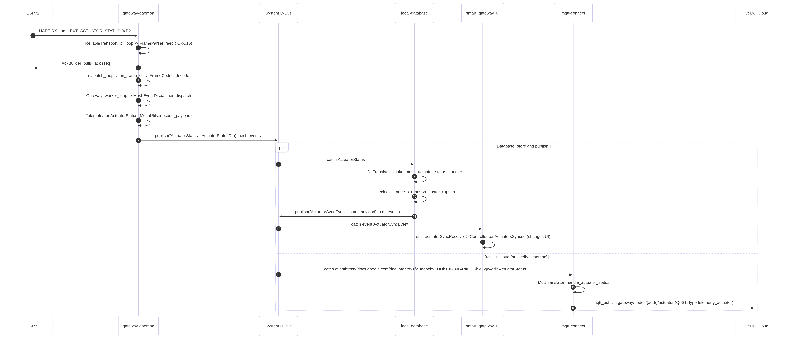
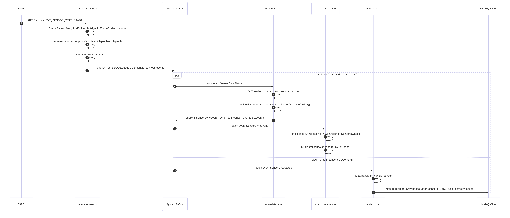
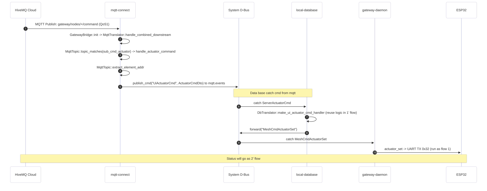

# Smart Home IoT Mesh Ecosystem

An embedded Linux (Yocto) gateway that bridges a **BLE Mesh** sensor/actuator network to a local **Qt/QML touch UI** and to **HiveMQ Cloud** over MQTT.
 
This document has two goals:

1. Explain **what the project is and how to build/run it**.
2. Teach the **background knowledge** you need to understand, debug and extend it (BLE Mesh, ESP-IDF, UART framing, D-Bus, SQLite, MQTT, Qt, systemd, Yocto, device tree).


## Table of Contents

1. [Project Overview](#1-project-overview)
2. [System Architecture](#2-system-architecture)
3. [Repository Layout](#3-repository-layout)
4. [Background Knowledge](#4-background-knowledge)
   - [4.1 BLE Mesh](#41-ble-mesh)
   - [4.2 ESP-IDF and ESP BLE Mesh](#42-esp-idf-and-esp-ble-mesh)
   - [4.3 UART framing, CRC16 and ARQ](#43-uart-framing-crc16-and-arq)
   - [4.4 D-Bus](#44-d-bus)
   - [4.5 Event-driven design and the DB as orchestrator](#45-event-driven-design-and-the-db-as-orchestrator)
   - [4.6 SQLite](#46-sqlite)
   - [4.7 MQTT and HiveMQ Cloud](#47-mqtt-and-hivemq-cloud)
   - [4.8 Qt / QML / QtCharts](#48-qt--qml--qtcharts)
   - [4.9 systemd](#49-systemd)
   - [4.10 Yocto Project](#410-yocto-project)
   - [4.11 Device tree overlays](#411-device-tree-overlays)
   - [4.12 Wi-Fi and TLS on the target](#412-wi-fi-and-tls-on-the-target)
   - [4.13 Concurrency patterns used in the daemon](#413-concurrency-patterns-used-in-the-daemon)
5. [Module Reference](#5-module-reference)
6. [Message Flows](#6-message-flows)
7. [Build and Flash Guide](#7-build-and-flash-guide)
8. [Firmware Guide (ESP32)](#8-firmware-guide-esp32)
9. [Further Reading](#13-further-reading)


---
 
## 1. Project Overview

| Capability | How it is done |
|---|---|
| Collect sensor data | ESP32 Provisioner receives BLE Mesh sensor messages and forwards them over UART |
| Control actuators | UI or cloud command goes through the DB, daemon and UART to the mesh |
| Edge automation | Groups with thresholds and auto mode are pushed into the mesh nodes |
| Local HMI | Qt/QML app with live charts |
| Cloud | MQTT bridge to HiveMQ Cloud, with remote control |
| Persistence | SQLite (nodes, actuators, sensor history, groups) |
| Deployment | Yocto image for Raspberry Pi with systemd services |

## 2. System Architecture
 


### System Architecture Overview

The system is built upon a **Host-NCP (Network Co-Processor)** model, combining a multi-process Linux Host (Raspberry Pi Zero 2 W) with a Real-Time Edge Network (ESP32). This strict separation of concerns ensures high stability, scalability, and zero-latency edge automation.

**1. Application Host Layer (Yocto Linux on Raspberry Pi)**
The software stack is decoupled into four independent microservices communicating exclusively via **System D-Bus (Pub/Sub)**. If one process (e.g., UI) crashes, the core daemon and database continue to operate autonomously.
*   **`local-database`**: The SQLite-based orchestrator and **Single Source of Truth**. It persists all local and remote configurations before re-broadcasting instructions, ensuring zero data loss upon unexpected reboots.
*   **`gateway-daemon`**: The C++ core application. It translates D-Bus DTOs into a custom binary protocol (Opcode + CRC16 + ARQ) and manages a reliable UART link to the physical layer.
*   **`smart_gateway_ui`**: The Qt/QML frontend rendering the HMI on an ILI9341 SPI display, operating strictly on an event-driven basis (`*SyncEvent`).
*   **`mqtt-connect`**: A TLS-secured bridge to HiveMQ Cloud. Using a "Virtual UI" pipeline, it translates downstream cloud commands into internal D-Bus signals, achieving 100% logic reuse.

**2. Edge Network Layer (ESP-IDF on ESP32 Series)**
Real-time radio operations are offloaded to dedicated microcontrollers to prevent Linux scheduling latencies.
*   **ESP32 Provisioner (NCP)**: Acts as the physical bridge. It processes UART frames from the gateway daemon, executes BLE Mesh provisioning, and routes Generic/Vendor Model messages into the wireless network.
*   **BLE Mesh Nodes (ESP32-H2/C6)**: The end devices (sensors, relays, AC controllers). They support **Edge Automation**: sensors publish telemetry directly to group addresses, allowing actuators to evaluate thresholds and trigger actions locally, even if the main gateway goes offline.


### Design rules
 
1. **No direct calls between processes.** Everything is a D-Bus signal (publish/subscribe).
2. **The DB is the single source of truth and the orchestrator.** Control and configuration commands go to the DB first. It saves them, then re-publishes (rebroadcasts) them to the daemon.
3. **`mqtt-connect` is a Virtual UI.** A cloud command is translated into the same D-Bus signal the UI would emit, so the whole downstream logic is reused.
4. **Status flows upward:** ESP32, daemon, DB (persist), then `*SyncEvent` to UI (and MQTT).

## 3. Repository Layout
 
```text
smart-home-gateway/
├── apps/                  # C++/Qt applications                       TODO: list sub-folders
├── firmware/
│   ├── esp32-mesh/
│   │   ├── provisioner/                   # BLE Mesh Provisioner + UART bridge
│   │   ├── node_ble_mesh_actuator_ac_r/   # Actuator node (AC / relay)
│   │   ├── rpr_server/                    # Remote Provisioning server
│   │   └── unprov_dev/                    # Unprovisioned device
│   └── nrf52-mesh/                        # Reserved
├── yocto/
│   └── meta-ble-mesh/                     # Custom Yocto layer
├── poky/                  # Yocto reference distribution
├── build/                 # Yocto build dir (generated)
├── downloads/             # Yocto DL_DIR (generated)
├── sstate-cache/          # Yocto shared-state cache (generated)
├── images/                # Output images
├── Dockerfile             # Reproducible build environment
├── run_docker.sh          # Start the build container
├── build.sh               # Build the image
├── autoflash.sh           # Flash the image
└── README.md
```
 
`yocto/meta-ble-mesh` in detail:
 
```text
meta-ble-mesh/
├── conf/layer.conf
├── recipes-app/                 gateway-app, local-database-app, mqtt-connect, ui-app
├── recipes-apps-config/         apps-config (runtime configuration files)
├── recipes-connectivity/
│   ├── openssl/                 openssl_%.bbappend
│   └── wifi-config/             wifi.conf, wifi-connect.sh, wpa_supplicant units
├── recipes-kernel/
│   ├── linux/                   linux-raspberrypi_%.bbappend + fragment.cfg
│   └── rapi-dts-overlays/       screen_overlayer.dts
└── recipes-service/app-service/ daemon-uart, local-database, mqtt-connect, ui-qt (.service)
```
 
---

## 4. Background Knowledge
 
Each topic below follows the same pattern: **what it is**, **why the project uses it**, **where it appears**, and **useful commands**.


### 4.1 BLE Mesh

**What it is:**
Bluetooth Mesh is a many-to-many, multi-hop networking topology built on Bluetooth Low Energy (BLE). It uses BLE advertising channels for communication and operates on a Publish-Subscribe messaging pattern. Key concepts include:
*   **Node Features:** Relay (extends range), Proxy (allows smartphones to connect via GATT), Friend (caching), and Low Power (sleeps and polls data).
*   **Addressing:** Unicast (unique per element), Virtual (Label UUID hash), and Group (dynamic or fixed, e.g., all-relays).
*   **Models:** Standardized behaviors defining states and messages. Includes Server (holds states), Client (requests/changes states), and Control models. Messages are defined by unique Opcodes (GET, SET, STATUS).
*   **Provisioning:** A secure 5-step process (Beaconing, Invitation, ECDH Public Key Exchange, OOB Authentication, and Data Distribution) to securely add unprovisioned devices to the network. It also supports Remote Provisioning (PB-Remote) to add devices outside direct radio range.

**Why the project uses it (vs. Zigbee / LoRa):**
*   **Direct Smartphone Access:** Unlike Zigbee, BLE is native to smartphones/PCs. Devices can be controlled directly via the GATT Proxy feature without mandating a network gateway.
*   **Higher Bandwidth:** BLE 4.2 offers data rates up to 1 Mbps, significantly faster than Zigbee's 250 Kbps limit (based on 802.15.4).
*   **Cost & Ecosystem:** The massive smartphone-driven scale of BLE makes its chipsets generally more cost-effective than Zigbee ICs.
*   **Practicality for Smart Homes:** While LoRa is excellent for WAN/long-range, operating in unlicensed ISM bands requires strict compliance with transmission power and duty cycle regulations, making it less ideal for high-density, real-time home automation. BLE Mesh is purpose-built for building automation and smart lighting.

**Where it appears in the project:**
*   **`firmware/esp32-mesh/provisioner/`**: The ESP32 acting as the network manager. It handles the 5-step provisioning process, securely assigning Unicast Addresses, NetKeys, and AppKeys to new nodes.
*   **`firmware/esp32-mesh/node_ble_mesh_actuator_ac_r/`**: The edge nodes implementing Server/Client Models. They subscribe to Group Addresses to receive `CMD_ACTUATOR_SET` messages (Opcode `0x32`) and publish `EVT_SENSOR_STATUS` (Opcode `0xB1`) back to the gateway.


### 4.2 ESP-IDF and ESP BLE Mesh
 
**What it is.** ESP-IDF is Espressif's SDK. It includes an ESP BLE Mesh stack. All `firmware/esp32-mesh/*` projects are ESP-IDF projects.
 
**Files you will see in each project**
 
| File / folder | Purpose |
|---|---|
| `CMakeLists.txt` | Top-level build file |
| `main/` | Application code (`app_main`) |
| `components/` | Local reusable components |
| `managed_components/`, `dependencies.lock` | Components downloaded by the IDF component manager. Do not edit by hand |
| `sdkconfig` | Generated config. Created from `sdkconfig.defaults*` and `menuconfig` |
| `sdkconfig.defaults`, `sdkconfig.defaults.<chip>` | Default options, applied per target chip |
| `partitions.csv` | Flash partition layout (app, NVS, ...). The BLE Mesh stack stores keys in NVS |
| `build/` | Build output (generated) |
 
**Typical workflow**
 
```bash
. $HOME/esp/esp-idf/export.sh            # load the toolchain (path may differ)
cd firmware/esp32-mesh/provisioner
idf.py set-target esp32                  # choose chip (esp32, esp32c3, esp32s3, ...)
idf.py menuconfig                        # Component config > Bluetooth > ESP BLE Mesh Support
idf.py build
idf.py -p /dev/ttyUSB0 flash monitor     # Ctrl+] to exit the monitor
idf.py -p /dev/ttyUSB0 erase-flash       # wipe NVS (forget all provisioning data)
```
 
**Notes**
 
- Changing the target chip wipes `sdkconfig`. Keep your options in `sdkconfig.defaults`.
- If a node was provisioned and you change its role, run `erase-flash` so old keys are removed.
- Pick **Bluedroid** or **NimBLE** host in menuconfig. The `sdkconfig.ci.*` files show tested combinations.
`TODO:` ESP-IDF version, UART number and pins used by the Provisioner for the gateway link.


 
### 4.3 UART framing, CRC16 and ARQ
UART is a raw byte stream with no message boundaries, no integrity check and no delivery guarantee. The project adds those three things.
 
**Frame format**
 
```text
START | opcode | addr (LE, 2B) | seq | type | len | payload (len bytes) | CRC16 (LE, 2B)
```
 
| Field | Role |
|---|---|
| `START` | Marks the beginning of a frame so the parser can resynchronise after garbage |
| `opcode` | What the frame means (command or event). See table below |
| `addr` | Target or source `element_addr` (little-endian) |
| `seq` | Sequence number used for ACK matching |
| `type` | Frame type (data, reliable data, ACK, ...). `TODO: exact values` |
| `len` | Payload length |
| `CRC16` | Integrity check over the frame. `TODO: polynomial/init (CCITT-FALSE, MODBUS, ...)` |
 
**Opcodes**
 
| Opcode | Name | Direction |
|---|---|---|
| `0x0A` | `CMD_GROUP_ADD` | Gateway to ESP32 |
| `0x0B` | `CMD_GROUP_DELETE` | Gateway to ESP32 |
| `0x0C` | `CMD_MODEL_PUB_SET` | Gateway to ESP32 |
| `0x32` | `CMD_ACTUATOR_SET` | Gateway to ESP32 |
| `0x34` | `CMD_THRESHOLD_CONFIG` | Gateway to ESP32 |
| `0x40` | `CMD_ACTUATOR_AUTO` | Gateway to ESP32 |
| `0xB1` | `EVT_SENSOR_STATUS` | ESP32 to Gateway |
| `0xB2` | `EVT_ACTUATOR_STATUS` | ESP32 to Gateway |
| `0xD0` | `EVT_GROUP_STATUS` | ESP32 to Gateway |
 
**Receive path (daemon)**
 
1. `ReliableTransport::rx_loop` reads bytes from the UART.
2. `FrameParser::feed` finds `START`, collects `len` bytes and checks the CRC. A bad CRC means the frame is dropped.
3. For reliable frames, `AckBuilder::build_ack` sends an ACK with the same `seq`.
4. `FrameCodec::decode` turns bytes into a frame structure.
5. `MeshEventDispatcher::dispatch` routes by opcode to `Telemetry::onSensorStatus`, `onActuatorStatus` or `onGroupStatus`, which publish D-Bus events.

**How Stop-and-Wait ARQ works:**
To ensure reliable UART communication between the Linux Host and the ESP32 Network Co-Processor, the `ArqController` implements a Stop-and-Wait ARQ (Automatic Repeat reQuest) mechanism. 
*   **Success:** When the Gateway transmits a frame (`seq=N`), it halts the transmission queue and waits. If a matching ACK arrives within `ARQ_TIMEOUT_MS`, the next frame is allowed to proceed.
*   **Retry & Failure:** If the timeout expires without an ACK (due to noise or MCU busy state), the Gateway retransmits the exact same frame. This retry loop repeats up to `ARQ_MAX_RETRY` times, after which the system reports a communication failure to prevent silent packet drops.


On a Raspberry Pi Zero 2W, make sure the serial console on that UART is disabled and the UART is enabled (`enable_uart=1` in `config.txt`, no `console=serial0` in `cmdline.txt`).
### 4.4 D-Bus

**What it is.** A message bus for inter-process communication on Linux. There are two buses: the **system bus** (one per machine, system-wide, used here) and the **session bus** (one per user login). In this project, System D-Bus acts as an internal message broker enabling a decoupled, multi-process microservice architecture.

**Vocabulary**

| Term | Role | Project Mapping & Concrete Values |
|---|---|---|
| **Bus name** | Well-known connection name owned by each process | `com.gateway.mesh`, `com.gateway.db`, `com.gateway.mqtt`, `com.gateway.ui` |
| **Object path** | Hierarchical identifier of the exported object instance | `/com/gateway/mesh`, `/com/gateway/db`, `/com/gateway/mqtt`, `/com/gateway/ui` |
| **Interface** | Namespace grouping signals and methods | `com.gateway.mesh.events`, `com.gateway.db.events`, `com.gateway.ui.events`, `com.gateway.mqtt.events` |
| **Signal / member** | Broadcast event name emitted without waiting for replies | `UiActuatorCmd`, `ActuatorStatus`, `ActuatorSyncEvent`, `SensorDataStatus`, `SensorSyncEvent`, `GroupSyncEvent` |
| **Match rule** | Low-level bus filter configured by subscribers | Matches by `sender` / `interface` / `member` via `g_dbus_connection_signal_subscribe` or `QDBusConnection::connect` |

**Why signals (Pub/Sub) instead of point-to-point IPC (Unix Domain Sockets / Shared Memory)?**
* **Native 1-to-Many Fan-Out:** Hardware events such as `SensorDataStatus` or `ActuatorStatus` must be delivered concurrently to the local database (persistence), UI (real-time graphs), and MQTT bridge (cloud sync). D-Bus eliminates the need for `gateway-daemon` to maintain custom routing tables, connection tracking, or individual peer sockets.
* **Process Lifecycle Decoupling:** Modules start and stop independently. If `smart_gateway_ui` crashes or restarts, `gateway-daemon` and `local-database` continue running without socket broken-pipe errors (`SIGPIPE`). When the UI recovers, it requests full state resynchronization (`SyncAllNodesCmd`, `SyncAllGroupsCmd`).
* **Clean Event Boundaries:** Payloads are serialized using lightweight DTO JSON wrappers (`ipc_dto.h`) encapsulated inside GVariant/QDBusVariant strings (`(v)`), keeping transport parsing isolated from business logic.

**Rules that matter in this project**

- **Publisher Interface Ownership:** A module emits signals on **its own interface**. A listener must subscribe to the **publisher's interface**, not its own.
  - `gateway-daemon` emits on `com.gateway.mesh.events`.
  - `local-database` emits on `com.gateway.db.events`.
  - `smart_gateway_ui` emits on `com.gateway.ui.events`.
  - `mqtt-connect` emits on `com.gateway.mqtt.events`.
- **No Native In-Bus Queuing:** Unhandled signals are dropped if no subscriber is active. To prevent state loss, `local-database` acts as the single source of truth, committing data before notifying consumers.
- **Implementation Split:**
  - Daemons (`gateway-daemon`, `local-database`, `mqtt-connect`) use **GDBus / GLib** wrapped by `DBusGDBus` (`common/src/dbus.cpp`), running an event loop on a dedicated thread (`dbus_init_thread`) and dispatching tasks via `ThreadSafeQueue<IpcTask>`.
  - The UI uses **Qt D-Bus (`QDbusImpl`)** integrated with Qt's event loop via `QDBusEventAdapter`.

**System bus policy.**
On Linux, unprivileged processes cannot own well-known names or broadcast signals on the system bus without an explicit configuration policy. 
- **Policy Path:** `/etc/dbus-1/system.d/com.gateway.conf` (deployed via the Yocto recipe `recipes-apps-config/apps-config`).
- **Permissions:** Grants default user permissions to own names (`com.gateway.*`), send method calls, and receive broadcast signals across all four gateway interfaces.

**Useful Diagnostic Commands**

```bash
# Monitor all signals across all gateway interfaces
dbus-monitor --system "type='signal',interface='com.gateway.db.events'" \
                      "type='signal',interface='com.gateway.mesh.events'" \
                      "type='signal',interface='com.gateway.ui.events'" \
                      "type='signal',interface='com.gateway.mqtt.events'"

# Check active gateway service names currently registered on the bus
busctl --system list | grep com.gateway

# Introspect an active module object interface
busctl --system introspect com.gateway.mesh /com/gateway/mesh com.gateway.mesh.events

# Manually trigger a database synchronization request from terminal
busctl --system emit /com/gateway/ui com.gateway.ui.events SyncAllNodesCmd "s" "{}"
```

### 4.5 Event-driven design and the DB as orchestrator
 
**Pattern.** The DB receives intent ("set group X with these members"), records it, then **orchestrates** the lower layer by emitting a series of commands. It later learns the result from events and updates its state.
 
**`mesh_applied` flag.** A group member has two states:
 
| `mesh_applied` | Meaning |
|---|---|
| `0` | Stored in the DB, but the mesh has not confirmed it |
| `1` | The ESP32 confirmed the publish/subscribe change via `GroupStatus` |
 
This is **eventual consistency**: the DB and the mesh are briefly different and converge when the status arrives. The UI sees both steps because `GroupSyncEvent` is emitted twice (once right after the commands are queued, once after confirmation).
 
**Idempotency.** Because ARQ may deliver a command twice, and the DB may re-send commands when a group is edited again, every command must be safe to repeat.
 
**Why re-publish instead of letting the UI talk to the daemon?** The DB keeps one authoritative history. It also gives one place to add validation, ordering and retries.


### 4.6 SQLite
 
**What it is.** An embedded, file-based SQL database. No server process.
 
**Why here.** Small footprint, ACID transactions, good enough for a gateway. The DB module is the only writer, so there are no cross-process locking problems.
 
**Data model (names inferred from the code, verify with `.schema`)**
 
| Table | Content |
|---|---|
| node | Provisioned devices and their `element_addr` |
| actuator | Target and present setpoint, on/off, status |
| sensor_reading | Time series (temperature, humidity, soil, lux, motion, battery) |
| mesh_group | Automation rules (name, auto mode, sensor type, thresholds) |
| group_member | Membership with role (sensor / actuator) and `mesh_applied` |

### 4.7 MQTT and HiveMQ Cloud
 
**What it is.** A lightweight publish/subscribe protocol over TCP. Clients connect to a **broker** (HiveMQ Cloud here).
 
| Concept | Notes |
|---|---|
| Topic | Hierarchical string, for example `gateway/nodes/0x0005/sensors` |
| Wildcards | `+` matches one level, `#` matches the rest. `gateway/nodes/+/command` matches every node |
| QoS 0 | At most once. Used for frequent sensor data |
| QoS 1 | At least once. Used for commands and actuator status (duplicates possible) |
| QoS 2 | Exactly once (not used here) |
| Retain | Broker stores the last message and gives it to new subscribers. Used for `sync_groups` |
| TLS | HiveMQ Cloud requires TLS on port **8883** with username and password |
| Last Will | Optional message published if the client drops. Useful for "gateway offline" |
 
**Topics in this project**
 
| Direction | Topic | QoS | Handler |
|---|---|---|---|
| Cloud to Gateway | `gateway/nodes/+/command` | 1 | `MqttTranslator::handle_actuator_command` |
| Gateway to Cloud | `gateway/nodes/<addr>/sensors` | 0 | `MqttTranslator::handle_sensor` |
| Gateway to Cloud | `gateway/nodes/<addr>/actuator` | 1 | `MqttTranslator::handle_actuator_status` |
| Gateway to Cloud | `gateway/telemetry/sync_groups` | 1, retain | `MqttTranslator::handle_group_sync_status` |
 
Command payload:
 
```json
{ "actuator_type": 1, "device_type": 1, "onoff": 1, "setpoint": 24 }
```
### 4.8 Qt / QML / QtCharts
 
**What it is.** Qt is a C++ UI framework. QML is its declarative UI language. C++ objects (for example `Controller`) are exposed to QML.
 
**Concepts used**
 
- **Signals and slots.** The UI calls a C++ slot or emits a signal such as `reqSendActuator`. The IPC layer (`IPCEvent`) connects it to a D-Bus publish. Incoming D-Bus events are re-emitted as Qt signals (`actuatorSyncReceive`, `sensorSyncReceive`, ...) and handled by `Controller::onActuatorsSynced`, `onSensorsSynced`, `onGroupsSynced`.
- **Models.** Lists shown in QML come from `QAbstractListModel` or similar C++ models.
- **QtCharts.** `Chart.qml` appends points to line series to draw sensor curves.
- **Thread rule.** UI objects live in the main thread. D-Bus callbacks must hop into it (queued signals).
**On the target (no desktop).** The UI usually runs full screen without X11/Wayland, using the **eglfs** platform plugin:
 
```bash
QT_QPA_PLATFORM=eglfs   # TODO: confirm in ui-qt.service
```
 
Touch input needs the right input device (see `QT_QPA_EVDEV_TOUCHSCREEN_PARAMETERS`) and the display overlay from section 4.11.

### 4.9 systemd
 
**What it is.** The init system. It starts services at boot in dependency order and restarts them if they crash.
 
**Units in this project** (`recipes-service/app-service/files/`)
 
| Unit | Starts |
|---|---|
| `local-database.service` | DB module |
| `daemon-uart.service` | `gateway-daemon` |
| `mqtt-connect.service` | MQTT bridge |
| `ui-qt.service` | Qt UI |
 
Typical unit anatomy:
 
```ini
[Unit]
Description=Gateway daemon
After=dbus.service local-database.service     # start order
Requires=dbus.service
 
[Service]
ExecStart=/usr/bin/gateway-daemon             # TODO: real path
Restart=on-failure
 
[Install]
WantedBy=multi-user.target
```
 
**Commands**
 
```bash
systemctl status daemon-uart.service
systemctl restart local-database.service
journalctl -u daemon-uart.service -f          # follow logs
journalctl -b -p err                          # errors since boot
systemctl list-dependencies multi-user.target
```
 
Start order matters: D-Bus first, then the DB, then daemon / MQTT / UI. If the DB starts late, signals sent earlier are lost. Use `After=` and consider a full sync request at start-up.


### 4.10 Yocto Project
 
**What it is.** A framework to build a custom embedded Linux distribution from source.
 
| Term | Meaning |
|---|---|
| Poky | Yocto's reference distribution (the `poky/` folder) |
| BitBake | The build engine |
| Layer | A folder of recipes and config (`meta-ble-mesh` is yours) |
| Recipe (`.bb`) | How to fetch, build and install one package |
| `.bbappend` | Modify an existing recipe without copying it (`openssl_%.bbappend`, `linux-raspberrypi_%.bbappend`) |
| Image | A list of packages that forms the root filesystem |
| `MACHINE` | Target hardware (a Raspberry Pi variant) |
| `DISTRO` | Distribution policy |
| `local.conf` / `bblayers.conf` | Build configuration / list of layers (in `build/conf/`) |
| `DL_DIR`, `SSTATE_DIR` | Source download cache / build-result cache (`downloads/`, `sstate-cache/`) |
 
 
**What each of your recipes does**
 
| Recipe | Purpose |
|---|---|
| `gateway-app`, `local-database-app`, `mqtt-connect`, `ui-app` | Build and install the four modules |
| `apps-config` | Install runtime config files |
| `app-service` | Install the systemd units |
| `wifi-config` | Install Wi-Fi scripts and `wpa_supplicant` config |
| `openssl_%.bbappend` | Adjust OpenSSL (TLS for MQTT) |
| `linux-raspberrypi_%.bbappend` + `fragment.cfg` | Add kernel options |
| `screen-overlayer` | Install the display device tree overlay |
 
The `%` in `openssl_%.bbappend` matches any version of the recipe.
 
**Everyday commands**
 
```bash
source poky/oe-init-build-env build              # enter the build environment
bitbake-layers show-layers                       # confirm meta-ble-mesh is listed
bitbake-layers add-layer ../yocto/meta-ble-mesh  # add the layer if missing
bitbake <your-image-name>                        # TODO: image name
bitbake -c cleansstate gateway-app               # force rebuild of one recipe
bitbake -e gateway-app | grep ^SRC_URI           # inspect recipe variables
```
 
Output is under `build/tmp/deploy/images/<machine>/`.
 
**Why Docker.** Yocto needs specific host packages and is sensitive to the host distribution. The `Dockerfile` pins that environment so every developer gets the same result.
 
**Disk and time.** A first build takes hours and tens of GB. Keep `downloads/` and `sstate-cache/` between builds; they make later builds fast.
 
### 4.11 Device tree overlays
 
**What it is.** The device tree describes hardware to the kernel. An **overlay** adds or modifies nodes at boot without rebuilding the base tree.
 
In this project `screen_overlayer.dts` describes the touch display. The `screen-overlayer` recipe compiles it with `dtc` into a `.dtbo`, which the Raspberry Pi firmware loads through `config.txt`:
 
```text
dtoverlay=screen_overlayer       # TODO: confirm name
```


### 4.12 Wi-Fi and TLS on the target
 
- `wifi-init.service` and `wifi-connect.service` plus `wifi-connect.sh` bring up Wi-Fi at boot. Credentials are in `wifi.conf` and the `wpa_supplicant-wlan0.conf` template.
- `wpa_supplicant@wlan0.service` manages the association.
- MQTT over TLS needs correct **time** (certificate validity) and a CA bundle. If TLS fails right after boot, check the clock (`timedatectl`) and that NTP is reachable.
### 4.13 Concurrency patterns used in the daemon
 
The daemon uses producer/consumer threads with queues:
 
| Thread / loop | Role |
|---|---|
| `ReliableTransport::tx_loop` | Takes frames from the TX queue and sends them through ARQ |
| `ReliableTransport::rx_loop` | Reads bytes from the UART and feeds the parser |
| `ReliableTransport::dispatch_loop` | Hands decoded frames to a callback |
| `Gateway::worker_loop` | Pulls mesh events and runs the dispatcher |
| `DBusGDBus::worker_thread_loop` | Runs D-Bus callbacks |
 
Core tools: `std::mutex`, `std::condition_variable`, thread-safe queues. Why separate threads? Reading the UART must never block on slow D-Bus work, and a send waiting for an ACK must not block receiving.
 
## 5. Module Reference
 
| Module | Recipe | systemd unit | D-Bus publishes on | Subscribes to |
|---|---|---|---|---|
| `smart_gateway_ui` | `ui-app` | `ui-qt.service` | `ui.events` | `ActuatorSyncEvent`, `SensorSyncEvent`, `GroupSyncEvent`, `NodeSyncEvent` |
| `local-database` | `local-database-app` | `local-database.service` | `db.events` | `Ui*` and group commands (UI, MQTT), `ActuatorStatus`, `SensorDataStatus`, `GroupStatus`, `NodeInfo`, `HeartbeatEvent` |
| `gateway-daemon` | `gateway-app` | `daemon-uart.service` | `mesh.events` | `MeshCmd*`, `Group*Cmd` (DB), `UuidWhitelistCmd` (UI, MQTT) |
| `mqtt-connect` | `mqtt-connect` | `mqtt-connect.service` | `mqtt.events` | `GroupSyncEvent`, `NodeSyncEvent`, mesh events (see Known Issues) |
 
## 6. Message Flows

The system operates on an event-driven architecture utilizing System D-Bus and MQTT. By persisting data first and decoupling processes, the system ensures zero data loss and flawless synchronization between the hardware edge and the cloud.

### Flow 1: Local Command (UI to Device)
Describes how a user interaction on the Qt/QML HMI is processed. The command is routed to the local SQLite database for persistence before being re-broadcast to the Gateway Daemon, which encodes it into a robust UART frame (Opcode + CRC16) for the ESP32 Provisioner.



### Flow 2: Actuator Status Feedback
Details the state synchronization after a hardware execution. Once the ESP32 reports a successful toggle, the Daemon emits a D-Bus signal. The Database captures this, updates its records, and simultaneously triggers both the UI (clearing the "pending" visual state) and the MQTT bridge (updating the cloud dashboard).



### Flow 3: Sensor Telemetry
Illustrates the asynchronous handling of environmental data. Sensor packets arriving via UART are dispatched over D-Bus, where they are concurrently consumed by the Database (for historical time-series storage), the UI (to update live QtCharts), and the MQTT module (to push to HiveMQ).



### Flow 4: Edge Automation Config Orchestration
Highlights the Database's role as a system orchestrator. A complex Automation Rule created on the UI is broken down by the Database into multiple hardware-level commands (Thresholds, Auto-Mode, Subscriptions). The Database manages a `mesh_applied` synchronization flag, ensuring the UI accurately reflects whether the mesh network has successfully applied the new configuration.


### Flow 5: Cloud Remote Control (Virtual UI)
Demonstrates the "Unified Pipeline" pattern. The MQTT bridge acts as a Virtual UI, translating incoming cloud payloads into the exact same local D-Bus signals emitted by the physical HMI. This completely abstracts the network layer, achieving 100% logic reuse for downstream processing.




## 7. Build and Flash Guide
 
### 7.1 Prerequisites
 
- Linux host (Ubuntu recommended), Docker, about 100 GB free disk
- ESP-IDF installed (for firmware only)
### 7.2 Build the Yocto image
 
```bash
cd smart-home-gateway
./run_docker.sh          # enter the build container
./build.sh               # TODO: what it does (init env, bitbake <image>)
```
 
Manual equivalent inside the container:
 
```bash
source poky/oe-init-build-env build
bitbake-layers show-layers
bitbake <your-image-name>
```
 
### 7.3 Flash the SD card
 
```bash
./autoflash.sh           # TODO: describe
```
### 7.4 First boot checklist
 
1. Edit `wifi.conf` (SSID, password) before building, or set it on the target.
2. Boot, then check services: `systemctl --failed`.
3. Check D-Bus traffic with `dbus-monitor` (section 9).
4. Check the UART device exists and the ESP32 is connected.
5. Check MQTT connection in `journalctl -u mqtt-connect -f`.
### 7.5 Updating one application quickly
 
```bash
bitbake -c cleansstate gateway-app && bitbake gateway-app
# then copy the new binary to the target, or rebuild the image
```

## 8. Firmware Guide (ESP32)
 
The edge network is powered by ESP32 microcontrollers (typically ESP32-C6/H2 for their native BLE 5.0/NimBLE support). They run FreeRTOS, ensuring strict timing for BLE Mesh flooding and advertising.

### 8.1 Hardware Setup & UART Link
The gateway daemon running on the Raspberry Pi communicates with the ESP32 Provisioner via a dedicated UART bridge.
*   **RPi GPIOs:** `TX (Pin 8)`, `RX (Pin 10)`, `GND`.
*   **ESP32 GPIOs:** Mapped in `sdkconfig` or `main.c` (e.g., `GPIO 17` for TX, `GPIO 16` for RX).
*   **Baud Rate:** `115200 8N1` (No parity, 1 stop bit).
*   **Level Shifting:** Both RPi and ESP32 use 3.3V logic, so they can be connected directly (Tx to Rx, Rx to Tx) along with a common Ground.

### 8.2 BLE Mesh Models Implementation
To support both standard smart home integration and custom edge automation, the firmware utilizes two types of BLE Mesh Models:
1.  **SIG Standard Models:** 
    *   `Configuration Server/Client`: Manages keys, subscriptions, and publication settings.
    *   `Generic OnOff Server/Client`: Used for basic Actuator control (Relay on/off, Light toggle).
2.  **Custom Vendor Models (`0x0001` - `0x0005`):**
    *   Since SIG standard models do not natively support complex rules (like AC temperature thresholds or auto-mode flags), we define **Vendor Models** (identified by our custom Company ID `0xFFFF`). 
    *   These models handle specialized opcodes (`CMD_THRESHOLD_CONFIG`, `CMD_ACTUATOR_AUTO`) and telemetry (`EVT_SENSOR_STATUS`).

### 8.3 Firmware Roles & Projects

#### A. The Provisioner (`firmware/esp32-mesh/provisioner/`)
This is the "Network Co-Processor" (NCP) attached directly to the Raspberry Pi.
*   **Role:** It does not act as a sensor or actuator. It manages the network and acts as the bridge.
*   **UART to Mesh:** It listens to UART interrupts. When it receives a frame from the RPi (e.g., `CMD_ACTUATOR_SET`), it translates it to an `esp_ble_mesh_client_model_send_msg()` call.
*   **Mesh to UART:** It listens for incoming mesh messages (telemetry, acks) via `ESP_BLE_MESH_MODEL_OP_STATUS` and encodes them into UART frames sent back to the Pi.
*   **Provisioning Flow:** 
    1. It scans for unprovisioned beacons and sends an `UnprovAdvEvent` to the Gateway. 
    2. If the UI whitelists the UUID, the RPi sends `CMD_ADD_UNPROV_DEV`. 
    3. The Provisioner triggers `esp_ble_mesh_provisioner_add_unprov_dev()`. 
    4. Upon success, it fires `PROV_COMPLETE_COMP_EVT` and sends `NodeInfo` back to the Gateway.

#### B. The Actuator/Sensor Nodes (`firmware/esp32-mesh/node_ble_mesh_actuator_ac_r/`)
These are the edge devices scattered around the house.
*   **Sensors (Temp, Humidity, Lux, PIR):** They run a hardware timer (e.g., every 30 seconds) or hardware interrupts (PIR). They read data via I2C/ADC, format it, and **Publish** the data to a designated **Group Address** (configured by the Gateway).
*   **Actuators (Relay, AC, Lights):** They **Subscribe** to the Gateway's commands and, more importantly, to the Sensor's Group Address.
*   **Zero-Latency Edge Automation:** 
    When an Actuator receives a `CMD_ACTUATOR_AUTO` command, its `is_auto` flag is set to `true`. From then on, if a Sensor publishes a temperature of 30°C to the Group Address, the Actuator receives it directly via the mesh. Its internal Vendor Model evaluates the `threshold_on` / `threshold_off` limits. If the condition is met, the Actuator toggles its GPIO **locally and instantly**, completely bypassing the Raspberry Pi and Wi-Fi network.

#### C. Remote Provisioning Server (`firmware/esp32-mesh/rpr_server/`)
*   Supports the PB-Remote bearer. It allows the main Provisioner to securely add devices that are physically located out of its direct Bluetooth radio range by routing the provisioning packets through intermediate nodes.

### 8.4 Typical Bring-up Sequence
1.  **Flash the Provisioner:** Build and flash the `provisioner` project to the ESP32 connected to the RPi. Reboot the RPi daemon to establish the UART handshake.
2.  **Flash a Node:** Build and flash `node_ble_mesh_actuator_ac_r` to a separate ESP32. Turn it on.
3.  **Discovery:** Check the Qt UI (or log) for the Unprovisioned Device UUID.
4.  **Provision:** Click "Provision" on the UI. The Gateway orchestrates the key exchange. Once done, the UI will display the new device with its assigned Unicast Address and Model features.
5.  **Configure:** Assign the node to a Group to begin Edge Automation.


## 9. Further Reading
 
| Topic | Link |
|---|---|
| Bluetooth Mesh specification | https://www.bluetooth.com/specifications/specs/mesh-protocol/ |
| ESP BLE Mesh guide | https://docs.espressif.com/projects/esp-idf/en/latest/esp32/api-guides/esp-ble-mesh/ble-mesh-index.html |
| ESP-IDF programming guide | https://docs.espressif.com/projects/esp-idf/ |
| D-Bus specification | https://dbus.freedesktop.org/doc/dbus-specification.html |
| MQTT specification | https://mqtt.org/mqtt-specification/ |
| HiveMQ Cloud docs | https://docs.hivemq.com/ |
| Yocto Project documentation | https://docs.yoctoproject.org/ |
| meta-raspberrypi | https://github.com/agherzan/meta-raspberrypi |
| Qt documentation | https://doc.qt.io/ |
| SQLite documentation | https://www.sqlite.org/docs.html |
| systemd manual | https://www.freedesktop.org/software/systemd/man/ |
 
## License
 
MIT. See [`yocto/meta-ble-mesh/COPYING.MIT`](yocto/meta-ble-mesh/COPYING.MIT). `TODO: confirm for the whole repository.`

